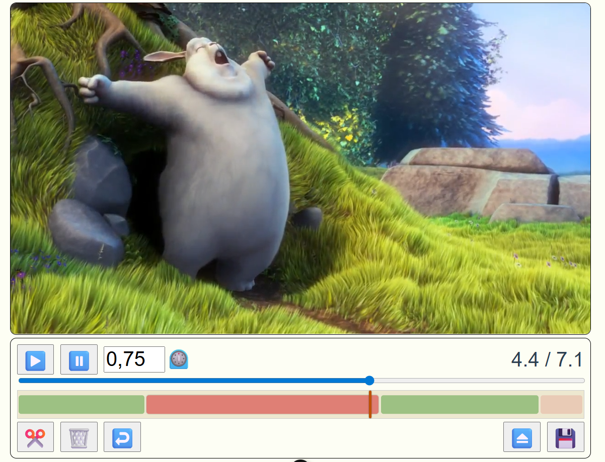
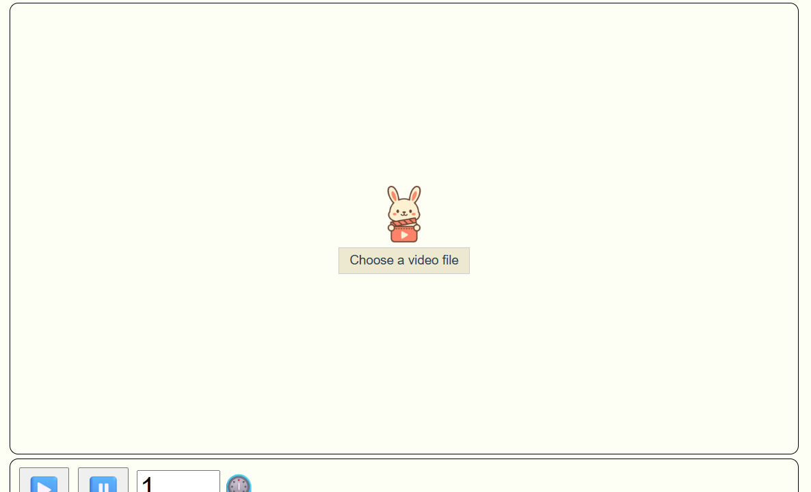
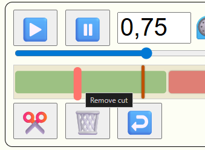
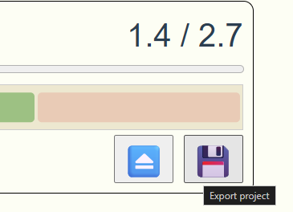

# Vustu

Vustu is a simple video editor that allows you to upload videos, make cuts, and export the edited video as a WebM file. It is built with Vue 3 and has client-side video export using the MediaRecorder API and Canvas CaptureStream, no server required.

- 100% Client-side Processing: No uploads, no server.
- Privacy-friendly: All editing and exporting happens locally in your browser.
- Fast and Lightweight: Minimal dependencies, quick load times.
- Cross-platform: Works on all OS, just needs a modern browser.

## Features

- Upload videos from your computer and edit them in the browser.
  
- Add cuts to the video timeline.
- Remove parts of the video.
- Undo cuts and deletions.
  
- Export the edited video as a WebM file.
  

## Technology

- Vue 3
- MediaRecorder API and Canvas CaptureStream
